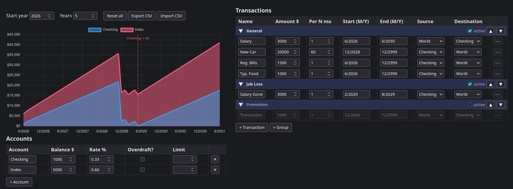

# $cenarios

A single-file, single-depedency web app for modelling your money between now and retirement.

Set up your accounts and the transactions that move money around, $cenarios will project every balance forward month by month to answer two questions:
- Do I ever run out of money?
- Will I still hit my target number by the time I stop working?

## How it works

Accounts have a starting balance and a growth rate (checking at 0%, an index fund at 7%, a card at -20%).
Transactions have an amount, a frequency, a start and end date, a source, and a destination.
Money moves between accounts or in and out of the "World", which is everything outside the accounts you track. Salary comes from World, rent goes to World, etc.

It charts every account over your horizon and flags any that dips below zero.

## What it is not 

$cenarios is not a drawdown planner, budgeting app, or Monte Carlo simulator. There is no tax engine, no inflation engine (yet), and no advice. $cenarios exists to help you project a forecast from the numbers you enter. There are plenty of other apps out there for deciding how much you need to retire, this app has no intention of replacing those.

It is unopinionated by design: it knows accounts and flows, nothing else. Don't want your emergency fund counted? Send it to World. Earmarked money like a college fund? Don't enter it. What you type is what you get.

## Installation / Getting started

Open index.html in a browser. Nothing to install, nothing to sign up for.

## AI Disclosure

I used an LLM to help me write the code quickly, but every section of the ~1500 LOC HTML was was curated, chosen, and reviewed by me.
